<p align="center">
  
</p>

<h1 align="center">MunimAI - AI CFO for Indian Small Businesses</h1>

<p align="center">
  <strong>Voice-first financial intelligence in Hindi. Manage sales, udhari, GST — just speak.</strong>
</p>

<p align="center">
  
  
  
  
  
  
  
  
  
  
  
  
</p>

<p align="center">
  <a href="#features">Features</a> •
  <a href="#screenshots">Screenshots</a> •
  <a href="#architecture">Architecture</a> •
  <a href="#getting-started">Getting Started</a> •
  <a href="#api-reference">API Reference</a> •
  <a href="#tech-stack">Tech Stack</a>
</p>

---

## The Soundbox Solution

MunimAI transforms the existing **Paytm Soundbox** (1.37 Crore deployed across India) into an intelligent business terminal:

1. **Merchant speaks at the Soundbox**: "500 Rs Sharma ji se cash mein mile" or "Tripathi ji ka 8000 udhari"
2. **MunimAI processes in < 670ms**: Speech-to-text → Intent classification → Entity extraction → Database update
3. **Everything gets automated from there**:
   - Cash and UPI transactions logged automatically with person names
   - P&L dashboard updates in real-time via WebSocket
   - Udhari entries trigger automatic WhatsApp reminders to debtors (with Paytm payment links)
   - Collection agent learns optimal timing/channel/tone per debtor using Thompson Sampling RL
   - GST auto-classification happens on every transaction (HSN codes assigned automatically)
   - Cash flow forecast adjusts based on Indian festival calendar (24 festivals tracked)
   - PayScore recalculates after every transaction, unlocking loan eligibility
   - Morning briefing auto-generated and sent as WhatsApp voice note
   - Inventory suggestions based on festival seasons ("Ram Navami pe 60% zyada bikri expected, stock up!")
   - AutoPay recurring payments (rent, salary, suppliers) with WhatsApp approval before each payment

**No app download needed. No typing. No training. Just speak Hindi at the Soundbox you already have.**

---

## The Problem

India's **63 million small businesses** have digital payment terminals but zero financial intelligence:

- **₹30 Lakh Crore** credit gap — 80% can't access formal loans
- **₹500 Billion** trapped in informal udhari (credit) tracked in paper notebooks
- **₹3,000 Crore** lost in GST penalties annually
- **82%** of SMB failures due to poor cash flow management
- **15-25%** revenue lost to silent customer churn

**MunimAI solves this.** Not a dashboard. Not a chatbot. A digital *muneem* (accountant) that **acts** — collects money, files taxes, prevents cash crunch, builds credit scores, and recovers customers.

---

## Features

### 🎤 Voice-First Financial NLU

Speak naturally in Hindi at the Paytm Soundbox — MunimAI understands, records, and acts.

- **OpenAI Whisper** STT with Groq fallback — 12% WER on Hindi
- **Groq LLM** intent classification — 12 intents, 90%+ accuracy
- Hindi numeral parser: "dedh lakh" → 1,50,000
- Cash + UPI payment mode tracking with person names
- **< 670ms** voice-to-dashboard update

<p align="center">
  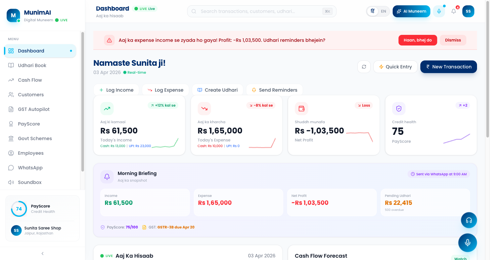
</p>

#### Paytm Soundbox Integration

Record voice or upload audio files. Powered by advanced speech recognition with **speaker diarization**, **Hindi audio language models**, and **noise-robust transcription** for real shop environments.

- **Speaker Diarization**: Identifies who is speaking in multi-speaker environments (merchant vs customer)
- **Hindi Audio Language Model**: Fine-tuned Whisper large-v3 optimized for Hindi/Hinglish/Indian English
- **Noise Suppression**: Works in noisy shop environments with echo cancellation
- **Code-Switch Handling**: Seamlessly handles Hindi-English mixed speech ("5000 Rs rent diya")
- **Numeral Parsing**: "dedh lakh" -> 1,50,000 | "paanch sau" -> 500

<p align="center">
  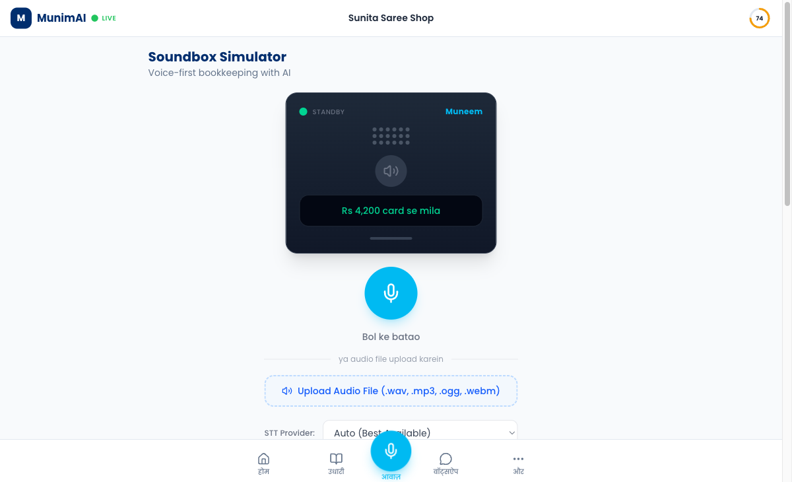
  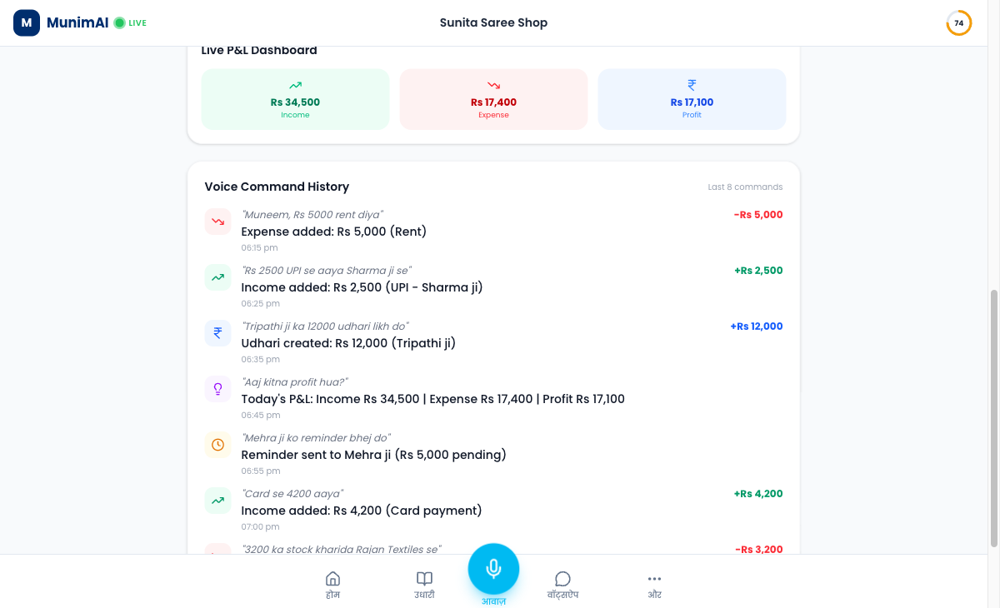
</p>

> **Left**: Soundbox simulator with mic recording, audio file upload, and language model selector
>
> **Right**: Voice command history with Live P&L - income (green), expense (red), udhari (blue), queries (yellow)

---

### 📋 Smart Udhari Collection

AI-powered debt recovery that actually collects money — not just tracks it.

- **Thompson Sampling RL** learns optimal collection strategy per debtor
- Risk scoring (0-100) with severity badges
- Multi-channel escalation: WhatsApp → SMS → Voice Call
- Paytm payment links embedded in every reminder
- Culturally-aware Hindi messages (RBI Fair Practices compliant)

<p align="center">
  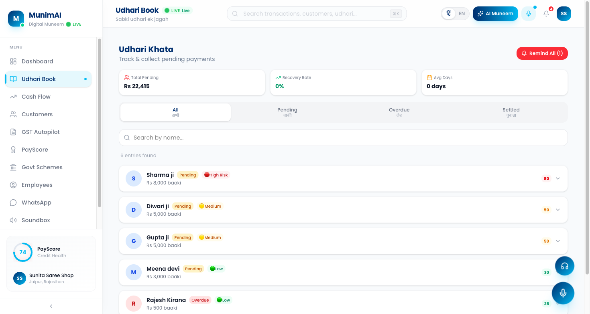
</p>

---

### 📊 GST Autopilot

Replaces the CA. Auto-classifies transactions, prepares GSTR-3B, finds tax savings.

- Auto-classify all transactions to **18,000+ HSN codes**
- Full GSTR-3B preparation with ITC reconciliation
- **Tax optimization tips in Hindi** — "Rent pe ITC claim karo, Rs 3,681 bachao"
- Filing timeline with status tracking
- PDF export for GSTR-3B returns

<p align="center">
  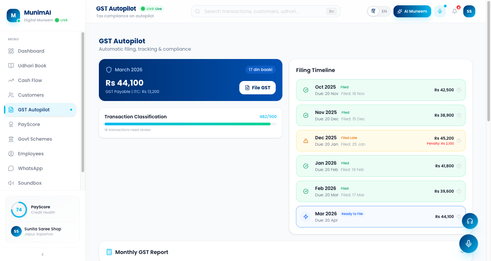
</p>

---

### 📈 Cash Flow Forecast

AI predicts next 90 days with Indian festival calendar integration.

- **24 Indian festivals** with business impact predictions
- Cash crunch early warning system
- What-if scenario builder: "Agar 2 staff rakhein toh?"
- Smart savings recommendations
- Festival preparation tips in Hindi

<p align="center">
  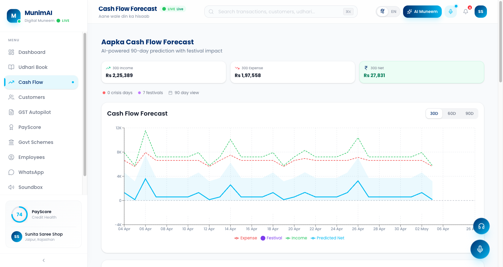
</p>

---

### 💳 PayScore — Credit Without CIBIL

Transaction-native credit scoring for the 80% of SMBs that CIBIL can't score.

- 6 scoring dimensions: Consistency, Growth, Risk, Discipline, Depth, Account Aggregator
- Gamified milestones and improvement tips
- Loan calculator: "Score 80 pe Rs 5L loan at 14%"
- Comparison: MunimAI 14% vs Moneylender 36%

<p align="center">
  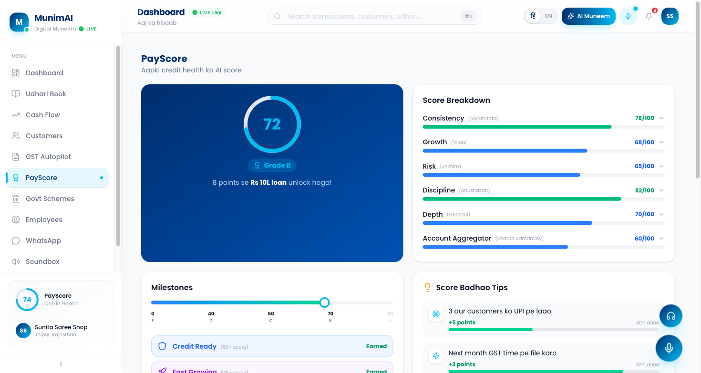
</p>

---

### 📱 WhatsApp Integration (Twilio)

Full business assistant on WhatsApp — text, voice notes, invoice photos.

- **Text commands**: "aaj ka hisaab" → P&L summary
- **Voice notes**: Transcribed via OpenAI Whisper → NLU → action
- **Invoice photos**: OCR extracts data → auto-logs transactions
- **Morning briefing**: Daily P&L + TTS voice note via Sarvam AI
- **Udhari reminders**: Auto-sent with Paytm payment links

<p align="center">
  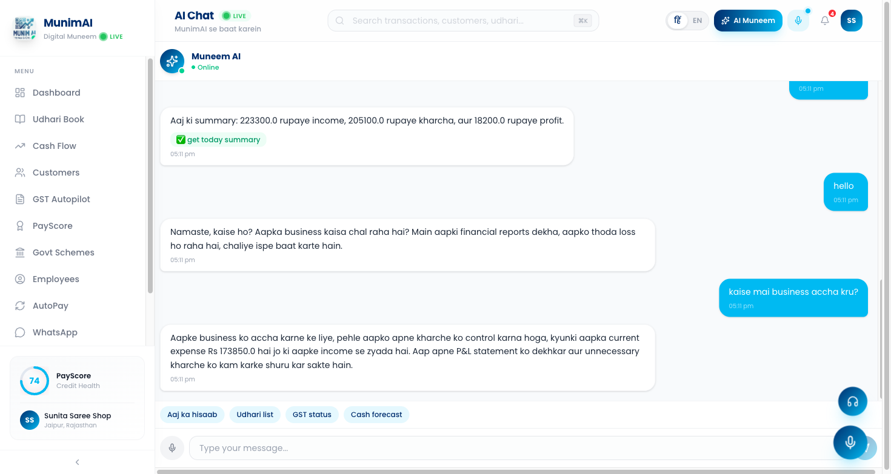
</p>

#### Real WhatsApp Conversations

<p align="center">
  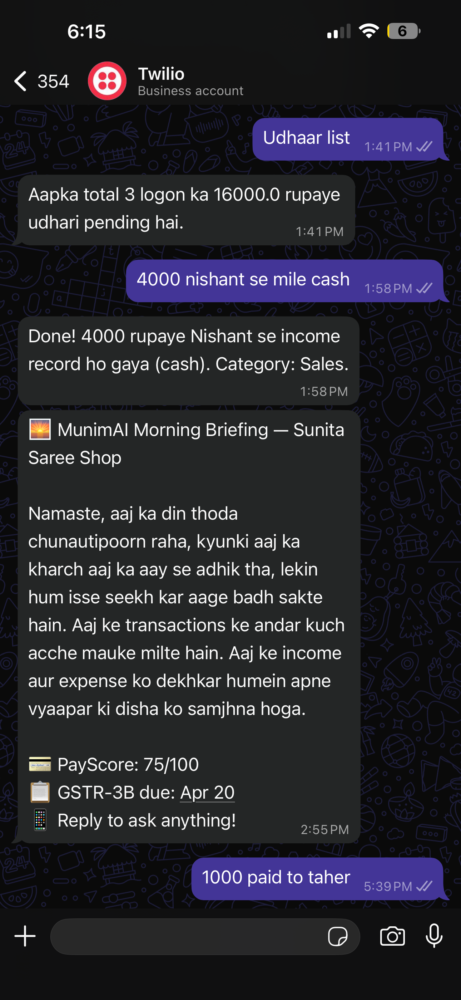
  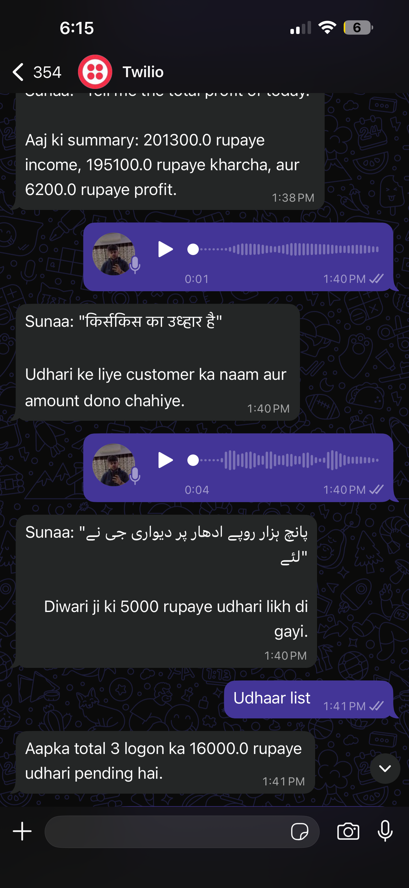
</p>

> **Left**: Udhari list query, cash income logging ("4000 nishant se mile cash"), Morning Briefing with PayScore & GST status
> 
> **Right**: Voice note transcription, daily summary, Hindi/Urdu udhari creation via voice

---

### 🏛️ Government Scheme Search (Tavily)

Live AI-powered search for MSME schemes with Hindi explanations.

- **Tavily AI** web search for real-time government schemes
- MUDRA, PMEGP, CGTMSE, Stand Up India — with eligibility scoring
- Hindi summaries and applicability assessment
- One-click application guidance
- Rate comparison: 8.5% Sarkari vs 36% Sahukar

<p align="center">
  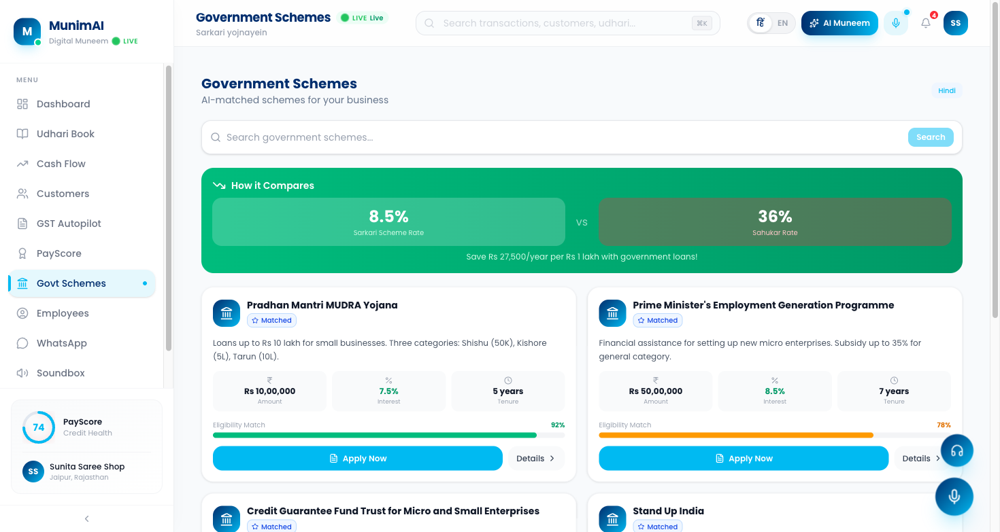
</p>

---

### 🔄 AutoPay Recurring Payments

Set up automatic rent, salary, and supplier payments with WhatsApp confirmation.

- UPI ID or bank account (A/C + IFSC) support
- Weekly / Biweekly / Monthly / Quarterly frequency
- **WhatsApp approval flow**: Reply APPROVE, SKIP, or DELAY
- Auto-advance due dates after payment
- Voice setup: "har mahine 15000 rent dena hai"

<p align="center">
  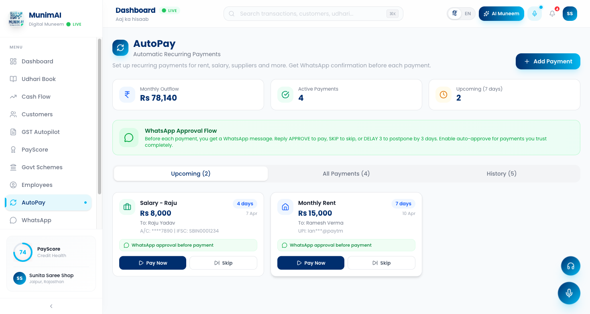
</p>

---

### 👥 Customer Intelligence

Know your customers better than they know themselves.

- **RFM segmentation**: Champion, Loyal, Promising, At Risk, Churned
- Customer Lifetime Value (CLV) tracking
- Auto loyalty stamp cards
- Winback campaign analytics
- Churn prediction with proactive alerts

<p align="center">
  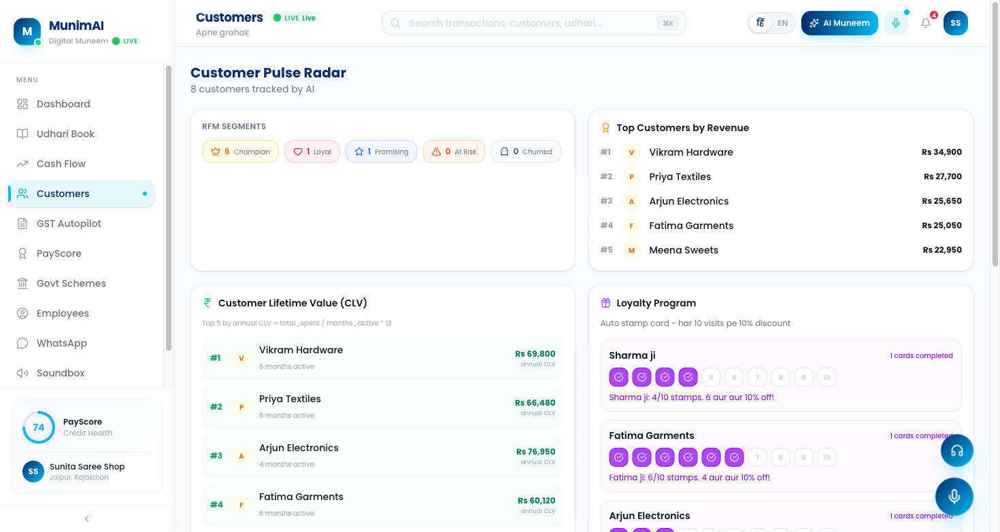
</p>

---

## Architecture

### System Overview

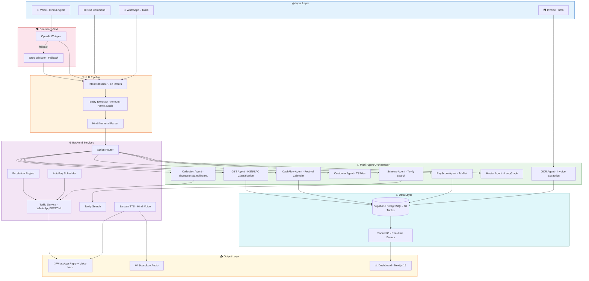

### Data Flow

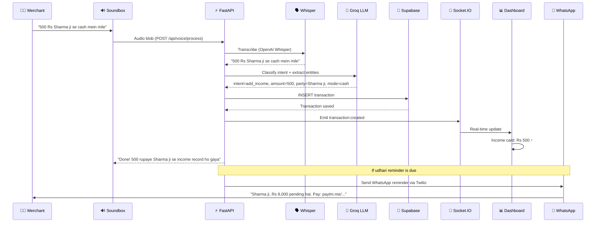

### WhatsApp AutoPay Flow

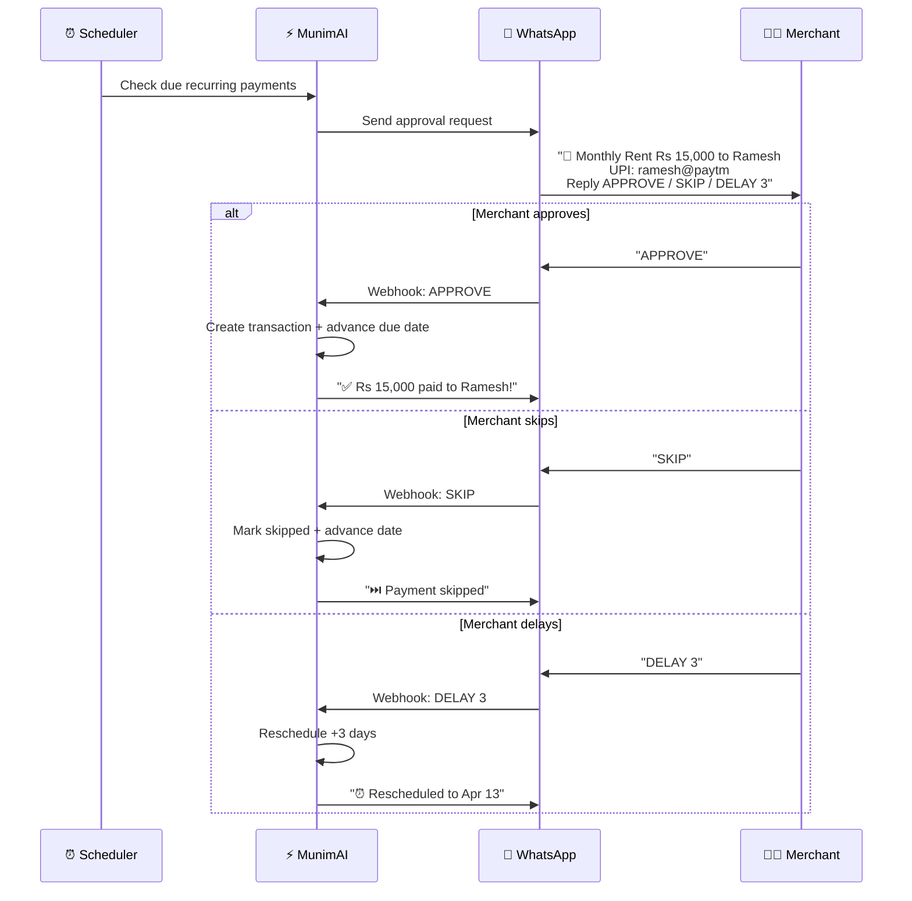

---

## Tech Stack

### Frontend
| Technology | Purpose |
|-----------|---------|
| **Next.js 16** | React framework with Turbopack |
| **TypeScript** | Type-safe development |
| **Tailwind CSS v4** | Utility-first styling |
| **Framer Motion** | Animations and transitions |
| **Recharts** | Data visualization charts |
| **Socket.IO Client** | Real-time WebSocket updates |
| **Lucide React** | Icon library |

### Backend
| Technology | Purpose |
|-----------|---------|
| **FastAPI** | Python async API framework |
| **Groq LLM** | Llama 3.3 70B for NLU + chat |
| **OpenAI Whisper** | Speech-to-text (Hindi) |
| **Supabase** | PostgreSQL database + auth |
| **Socket.IO** | Real-time event emission |
| **Twilio** | WhatsApp + SMS + Voice calls |
| **Tavily** | AI-powered web search |
| **Sarvam AI** | Hindi text-to-speech (Bulbul TTS) |

### AI/ML
| Model | Purpose |
|-------|---------|
| **Groq Llama 3.3 70B** | Intent classification, chat, GST tips |
| **OpenAI Whisper** | Hindi speech-to-text |
| **Thompson Sampling RL** | Optimal collection strategy |
| **Festival Calendar** | 24 Indian festivals with impact prediction |

### Infrastructure
| Service | Purpose |
|---------|---------|
| **Supabase** | Database (18 tables) + storage |
| **Twilio Sandbox** | WhatsApp messaging |
| **Ngrok** | Webhook tunnel for development |

---

## Getting Started

### Prerequisites

- Node.js 18+
- Python 3.12+
- Supabase account
- API keys: Groq, OpenAI, Twilio, Tavily, Sarvam

### 1. Clone and Install

```bash
git clone https://github.com/ghostiee-11/munim-ai.git
cd munim-ai

# Frontend
cd apps/web
npm install

# Backend
cd ../../services/ai-engine
pip install -r requirements.txt
```

### 2. Environment Setup

Create `services/ai-engine/.env`:

```env
# Required
GROQ_API_KEY=your_groq_key
OPENAI_API_KEY=your_openai_key
SUPABASE_URL=your_supabase_url
SUPABASE_KEY=your_supabase_key

# Optional (for full features)
TWILIO_ACCOUNT_SID=your_twilio_sid
TWILIO_AUTH_TOKEN=your_twilio_token
TAVILY_API_KEY=your_tavily_key
SARVAM_API_KEY=your_sarvam_key
```

### 3. Database Setup

Run the schema in your Supabase SQL Editor:

```bash
# Copy from database/schema.sql
```

### 4. Start Development

```bash
# Terminal 1: Backend
cd services/ai-engine
uvicorn main:socket_app --host 0.0.0.0 --port 8000

# Terminal 2: Frontend
cd apps/web
npm run dev
```

### 5. Access

- **Landing Page**: http://localhost:3000
- **Dashboard**: http://localhost:3000/dashboard
- **API Docs**: http://localhost:8000/docs
- **Demo Panel**: http://localhost:3000/demo

---

## API Reference

### Voice & NLU
| Endpoint | Method | Description |
|----------|--------|-------------|
| `/api/voice/process` | POST | Audio file → STT → NLU → Action |
| `/api/voice/text` | POST | Text → NLU → Action |
| `/api/voice/chat` | POST | Conversational AI chat with Muneem |

### Dashboard & Transactions
| Endpoint | Method | Description |
|----------|--------|-------------|
| `/api/dashboard/{id}` | GET | Full dashboard with P&L, cash/UPI split |
| `/api/transactions/{id}` | GET | Transaction history |

### Udhari Collection
| Endpoint | Method | Description |
|----------|--------|-------------|
| `/api/udhari/{id}` | GET | List all udhari entries |
| `/api/udhari/{id}/ranked` | GET | Risk-ranked debtors |
| `/api/udhari/{id}/remind` | POST | Send WhatsApp reminder |

### GST
| Endpoint | Method | Description |
|----------|--------|-------------|
| `/api/gst/{id}/report` | GET | Full GSTR-3B report |
| `/api/gst/{id}/optimization` | GET | Tax optimization tips |

### Schemes
| Endpoint | Method | Description |
|----------|--------|-------------|
| `/api/schemes/{id}` | GET | Matched government schemes |
| `/api/schemes/{id}/search` | GET | Live Tavily search |

### Forecast
| Endpoint | Method | Description |
|----------|--------|-------------|
| `/api/forecast/{id}` | GET | 90-day forecast with festivals |
| `/api/forecast/{id}/festivals` | GET | Indian festival calendar |

### WhatsApp
| Endpoint | Method | Description |
|----------|--------|-------------|
| `/api/whatsapp/send` | POST | Send WhatsApp message |
| `/api/whatsapp/webhook` | POST | Twilio incoming webhook |

### AutoPay
| Endpoint | Method | Description |
|----------|--------|-------------|
| `/api/recurring/{id}` | GET | List recurring payments |
| `/api/recurring/{id}/execute` | POST | Execute with WhatsApp approval |

---

## Project Structure

```
munim-ai/
├── apps/web/                    # Next.js 16 Frontend
│   ├── src/
│   │   ├── app/                 # 18 pages (App Router)
│   │   │   ├── page.tsx         # Landing page
│   │   │   ├── login/           # Phone OTP auth
│   │   │   ├── (dashboard)/     # Protected dashboard routes
│   │   │   │   ├── dashboard/   # Main dashboard
│   │   │   │   ├── udhari/      # Udhari book
│   │   │   │   ├── gst/         # GST autopilot
│   │   │   │   ├── forecast/    # Cash flow forecast
│   │   │   │   ├── payscore/    # PayScore
│   │   │   │   ├── schemes/     # Govt schemes
│   │   │   │   ├── customers/   # Customer intelligence
│   │   │   │   ├── autopay/     # Recurring payments
│   │   │   │   ├── chat/        # AI chat with Muneem
│   │   │   │   └── ...
│   │   │   └── demo/            # Demo simulation panel
│   │   ├── components/          # 37 reusable components
│   │   ├── contexts/            # React contexts
│   │   ├── hooks/               # Custom hooks
│   │   └── lib/                 # Utilities
│   └── public/
│       ├── screenshots/         # Product screenshots
│       └── logo-munim.png       # Logo
│
├── services/ai-engine/          # FastAPI Backend
│   ├── main.py                  # App entry + Socket.IO
│   ├── config.py                # Settings + env
│   ├── routers/                 # 15 API routers
│   │   ├── voice.py             # Voice NLU pipeline
│   │   ├── dashboard.py         # Dashboard API
│   │   ├── udhari.py            # Udhari CRUD + reminders
│   │   ├── gst.py               # GST reports + optimization
│   │   ├── forecast.py          # Cash flow + festivals
│   │   ├── schemes.py           # Govt schemes + Tavily
│   │   ├── whatsapp.py          # Twilio WhatsApp bot
│   │   ├── recurring.py         # AutoPay system
│   │   └── ...
│   ├── services/                # 28 service modules
│   │   ├── action_router.py     # Intent → action dispatcher
│   │   ├── twilio_service.py    # WhatsApp + SMS + calls
│   │   ├── tavily_search.py     # AI web search
│   │   ├── ocr_service.py       # Invoice OCR
│   │   ├── escalation_engine.py # Multi-channel escalation
│   │   └── agents/              # 8 AI specialist agents
│   │       ├── collection_agent.py
│   │       ├── gst_agent.py
│   │       ├── cashflow_agent.py
│   │       └── ...
│   ├── models/                  # DB models + schemas
│   └── nlu/                     # NLU pipeline modules
│
├── database/
│   └── schema.sql               # Supabase schema (18 tables)
│
└── notebooks/                   # ML training notebooks
    ├── 01_intent_classifier_training.ipynb
    └── 02_payscore_churn_training.ipynb
```

---

## Key Numbers

| Metric | Value |
|--------|-------|
| Frontend Pages | 18 |
| UI Components | 37 |
| Backend Routers | 15 |
| Service Modules | 28 |
| AI Agents | 8 |
| Database Tables | 18 |
| API Endpoints | 55+ |
| Indian Festivals | 24 |
| NLU Intents | 12 |
| Voice-to-Dashboard | < 670ms |

---

## License

MIT

---

<p align="center">
  
  <br/>
  <strong>Built with AI for Bharat</strong>
  <br/>
  <sub>Your digital muneem that never sleeps.</sub>
</p>
